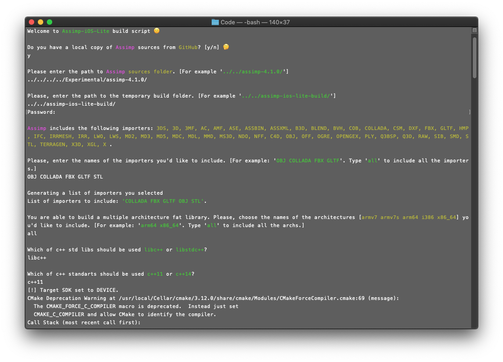

# Assimp iOS Light Superbuild

This script will help you to build your own custom light version of Assimp for iOS 🙂

## Features

* Easy-to-use
* Automatic download of Assimp sources if needed
* Select between latest release`v4.1.0` and master branch
* Choose necessary `importers`
* Choose necessary `architectures`
* Choose necessary `C++ version`
* Choose necessary `STD lib`

<p align="center">
    
</p>

## Requirements

* Xcode 9 or later
* CMake

## How To Use

```shell
git clone https://github.com/eugenebokhan/Assimp-iOS-Light-Superbuild.git
cd Assimp-iOS-Light-Superbuild/Code/
./build_assimp_ios_lite.sh
```

## Author
| [](https://github.com/eugenebokhan)   | [Eugene Bokhan](https://github.com/eugenebokhan)<br/><br/><sub>iOS Software Engineer</sub><br/> [![Twitter][1.1]][1] [![Github][2.1]][2] [![LinkedIn][3.1]][3]|
| - | :- |

[1.1]: http://i.imgur.com/wWzX9uB.png (twitter icon without padding)
[2.1]: http://i.imgur.com/9I6NRUm.png (github icon without padding)
[3.1]: https://www.kingsfund.org.uk/themes/custom/kingsfund/dist/img/svg/sprite-icon-linkedin.svg (linkedin icon)

[1]: https://twitter.com/eugenebokhan
[2]: https://github.com/eugenebokhan
[3]: https://www.linkedin.com/in/eugenebokhan/

## License

[Project's license](LICENSE) is based on the BSD 3-Clause.
